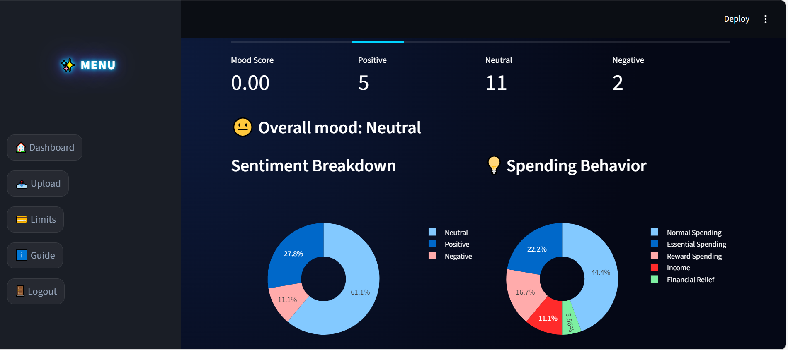

# 💸 Spending Tracker
This app helps users understand their
spending habits, manage budgets, and make
better financial decisions.
An AI-powered finance dashboard to track
spending, analyze behavior, and provide
smart insights. It detects user sentiment by
automatically reading transaction
descriptions to understand the 'mood'
behind every purchase.
 

 ## 🛠 Tech Stack
* **Language:** Python
* **Framework:** Streamlit
* **Database:** SQLite (Development)
* **Styling:** [CSS]​
• SQLAlchemy (ORM)​
• Pandas (data processing)​
• Requests (API calls)

# SYSTEM Structure​
  finance-tracker-app/​

├── app.py, main.py, finance.db, README.md,
requirements.txt​

├── app_pages/ → dashboard.py, limits.py,
upload_statement.py​

├── assets/ → login_bg.png, icons/​

├── auth/ → login.py, register.py​

├── database/ → db.py, models.py, migrate_sentiment.py​

├── services/ → ai_insights.py, categorizer.py, chatbot.py,
parser.py, insights.py​

└── utils/ → behavior_analysis.py, helpers.py,
sentiment_feedback.py

# Algorithms Used​
• VADER Sentiment Analysis​
• Rule-based classification​
• Spending behavior detection​
• GPT (LLM for chatbot & insights)
 

 ## 🚀 How to Run This Project

**Clone the repository:**
   ```bash
   git clone (https://github.com/zahran7770/capstone_project.git)
   cd CapStone_Project
# Install dependencies:
Bash
pip install -r requirements.txt
Bash
streamlit run app.py

